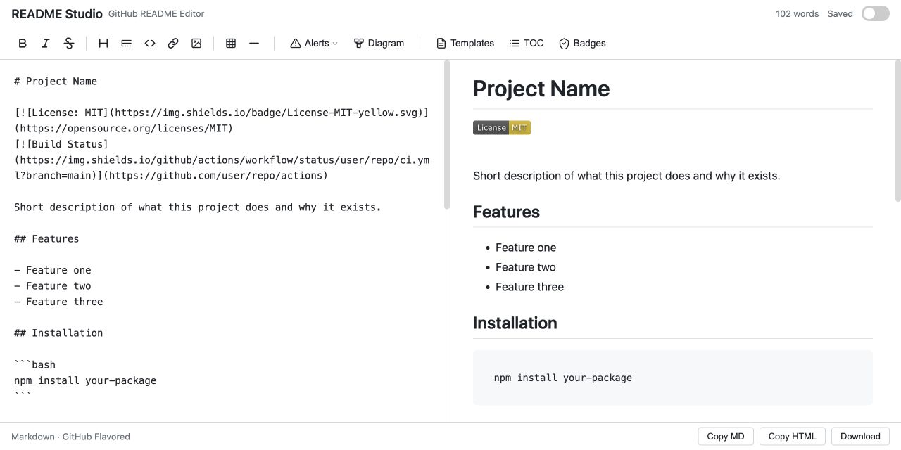

# README Studio

A GitHub README authoring tool with pixel-perfect preview, GitHub-specific Markdown extensions, templates, and a badge builder.

Write READMEs that look exactly like they will on GitHub — with alerts, Mermaid diagrams, math, syntax highlighting, and more.

[](https://github.com/daniissac/readme-studio/actions/workflows/ci.yml)
[](LICENSE)

**[Open README Studio](https://daniissac.com/readme-studio/)** · [View the source](https://github.com/daniissac/readme-studio)

[](https://daniissac.com/readme-studio/)

## Features

### Pixel-Perfect GitHub Preview

The preview pane uses [github-markdown-css](https://github.com/sindresorhus/github-markdown-css) for rendering that matches GitHub's actual styling. What you see is what you get.

### GitHub Markdown Extensions

- **Alerts** — `> [!NOTE]`, `> [!TIP]`, `> [!IMPORTANT]`, `> [!WARNING]`, `> [!CAUTION]` render as styled callout boxes with icons
- **Mermaid Diagrams** — fenced code blocks with `mermaid` language render as interactive diagrams
- **Math** — inline `$x^2$` and block `$$\sum_{i=0}^n$$` expressions render via KaTeX
- **Task Lists** — `- [x]` and `- [ ]` render as GitHub-styled checkboxes
- **Syntax Highlighting** — code blocks are highlighted with highlight.js using the GitHub theme

### README Templates

One-click starter templates for common documentation needs:

- **Project README** — badges, install, usage, API, contributing, license
- **Profile README** — about me, tech stack, stats, projects
- **Contributing Guide** — code of conduct, PR process, dev setup
- **Changelog** — keep-a-changelog format
- **Minimal** — title, description, license

### Badge Builder

Build shields.io badges without memorizing the URL format:

- Build status (GitHub Actions)
- npm version and downloads
- License badges (MIT, Apache, GPL)
- Code coverage
- Custom badges with any label, message, color, and link

### Authoring Tools

- **Table of Contents generator** — scans headings and inserts a linked TOC using GitHub's anchor algorithm
- **Formatting toolbar** — bold, italic, strikethrough, headings, blockquotes, code blocks, links, images, tables, horizontal rules
- **Alert insertion** — dropdown with all 5 GitHub alert types
- **Mermaid insertion** — starter diagram template
- **Tab key support** — inserts spaces instead of changing focus
- **Scroll sync** — editor and preview scroll together

### Export

- **Copy Markdown** — raw content to clipboard
- **Copy HTML** — rendered HTML to clipboard
- **Download** — save as `README.md`

### Dark Mode

Toggle between light and dark themes. The preview pane switches between GitHub's light and dark markdown styles.

## Getting Started

The fastest way to use the editor is the [hosted app](https://daniissac.com/readme-studio/). To run it locally:

```bash
git clone https://github.com/daniissac/readme-studio.git
cd readme-studio
npm install
npm run dev
```

Open `http://localhost:5173` in your browser.

### Build for Production

```bash
npm run build
```

Output goes to `dist/`. Deploy to any static host.

## Keyboard Shortcuts

| Shortcut | Action |
|----------|--------|
| `Ctrl+B` | Bold |
| `Ctrl+I` | Italic |
| `Ctrl+S` | Download README.md |
| `Tab` | Insert spaces |

## Tech Stack

- [Vite](https://vitejs.dev/) — build tool
- [marked](https://marked.js.org/) — Markdown parser
- [github-markdown-css](https://github.com/sindresorhus/github-markdown-css) — GitHub-accurate preview styles
- [highlight.js](https://highlightjs.org/) — syntax highlighting
- [mermaid](https://mermaid.js.org/) — diagram rendering
- [KaTeX](https://katex.org/) — math rendering
- [DOMPurify](https://github.com/cure53/DOMPurify) — XSS protection

## Contributing

Bug reports and focused pull requests are welcome. Run the test and production build before opening a pull request:

```bash
npm test
npm run build
```

## License

[MIT](LICENSE)
